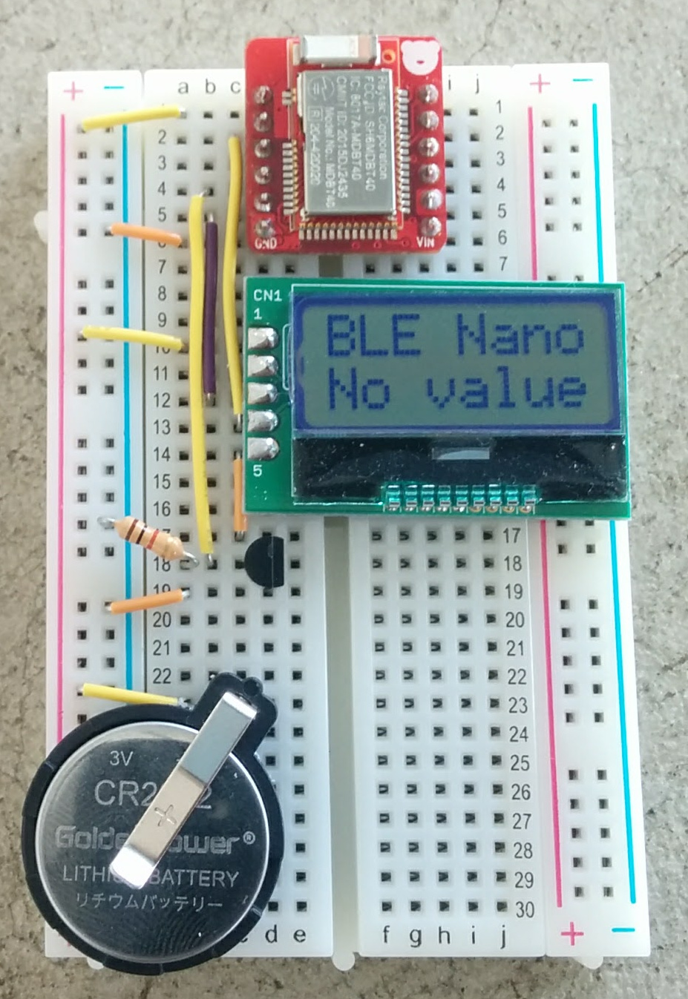
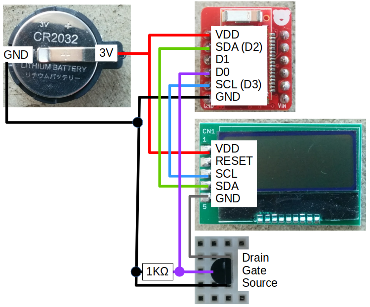

# BLENanoLCD
An Arduino IDE project for BLE nano to use LCD.

# Components
- [BLEnano Kit](https://www.switch-science.com/catalog/2875/)
- [LCD Kit](http://akizukidenshi.com/catalog/g/gK-06795/)
- [BreadBoard](http://akizukidenshi.com/catalog/g/gP-05294/)
- [1K registor](http://akizukidenshi.com/catalog/g/gR-07820/)
- [Jumper wire](http://akizukidenshi.com/catalog/g/gP-00288/)
- [Coin battery CR2032](http://akizukidenshi.com/catalog/g/gB-05694/)
- [CR2032 holder](http://akizukidenshi.com/catalog/g/gP-00706/)
- [MOSFET 2N7000](http://akizukidenshi.com/catalog/g/gI-09723/)

# Connection

# Software
## Arduino IDE
[Arduino Software](https://www.arduino.cc/en/Main/Software)

## Arduiuno IDE Board Setting
Install [nRF51822-Arduino](https://github.com/RedBearLab/nRF51822-Arduino).

## Arduino IDE Library
Install [ST7032: I2C LCD driver](https://github.com/tomozh/arduino_ST7032).

# Reference
[BLE nano](http://redbearlab.com/blenano/)

# License
MIT